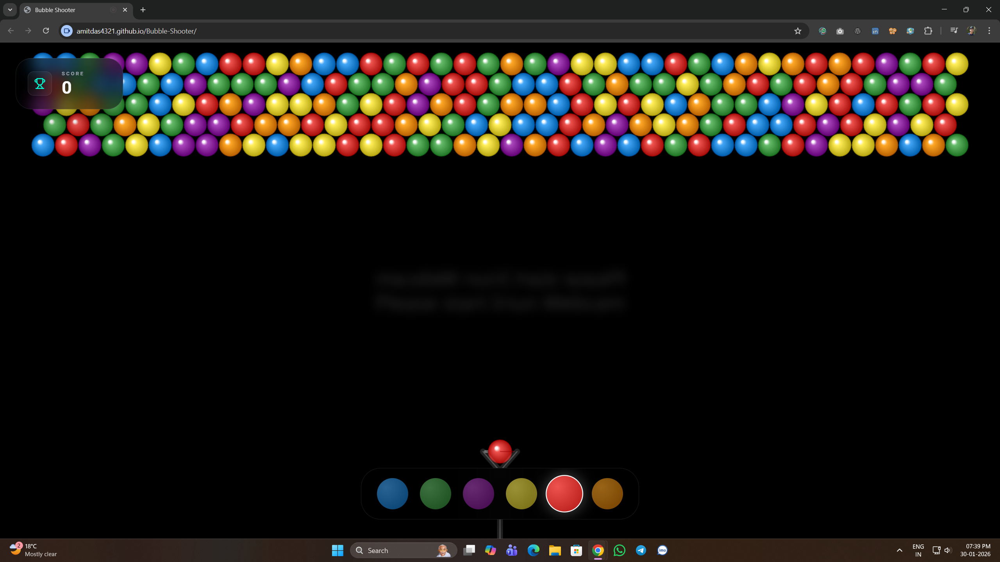

<p align="center">
  
</p>

<h1 align="center">Bubble Shooter (Hand Gesture Controlled)</h1>

<p align="center">
  <b>Play Bubble Shooter using your hands — pinch to grab, pull to aim, release to shoot.</b><br>
  Built with <b>MediaPipe Hands</b> + <b>HTML5 Canvas</b> + <b>JavaScript</b>
</p>

<p align="center">
  <b>Version 1.0.0</b> • Developed by <a href="https://amitdas.site">Amit Das</a>
</p>

---

## 🔗 Live Demo

🎮 **Play on CodePen:**  
👉 https://codepen.io/AmitDas4321/pen/RNRQJgy

---

## 🚀 Overview

**Bubble Shooter (Hand Gesture Controlled)** is a modern, AI-inspired browser game where you control the slingshot using **real-time hand tracking**.

Instead of mouse or touch, the game uses **MediaPipe Hands** to detect a **pinch gesture** (thumb + index), letting you **grab, aim, and shoot** bubbles naturally.

The webcam runs as a **cinematic blurred background**, while the gameplay stays sharp on a responsive Canvas UI.

---

## ✨ Features

- 🖐️ Real-time **hand tracking**
- 🤏 **Pinch to grab**, release to shoot
- 🎯 Slingshot physics (bounce walls + friction)
- 💥 Match-3 popping + particle effects
- 🎨 Smart color picker
- 📱 Fully responsive (mobile + desktop)
- 🔒 Privacy-friendly (no camera data leaves your browser)

---

## 🎮 How to Play

1. Open the game (GitHub Pages or CodePen)
2. Allow **camera access**
3. Bring your hand in front of the camera
4. Pinch near the shooter bubble to grab it
5. Pull back to aim
6. Release to shoot
7. Match **3+ same-color bubbles** to score

---

## 🤏 Gesture Controls

| Gesture               | Action             |
|-----------------------|--------------------|
| Pinch (Thumb + Index) | Grab bubble        |
| Move while pinching   | Aim                |
| Release pinch         | Shoot              |

---

## 🧰 Tech Stack

- **HTML5 Canvas**  
- **JavaScript (ES Modules)**  
- **TailwindCSS (CDN)**  
- **MediaPipe Hands**  
- **MediaPipe Camera Utils**  
- **MediaPipe Drawing Utils**  

---

## 🚀 Run Locally

> Camera may not work with `file://` — use a local server.

### Option 1: VS Code Live Server

1. Install **Live Server**
2. Right-click `index.html` → **Open with Live Server**
3. Allow camera access

### Option 2: Python

```bash
python -m http.server 5500
````

Open in browser:

```txt
http://localhost:5500
```

---

## 📁 Project Structure

```txt
/
├─ index.html
├─ LICENSE
├─ FUNDING.yml
├─ screenshots/
│  ├─ BubbleShooter_Banner.png
│  └─ gameplay.png
└─ README.md
```

---

## 🖼️ Screenshots

<p align="center"></p>

---

## 🔒 Privacy

* Camera is used only for **hand landmark detection**
* All processing runs **locally in the browser**
* No data is stored or transmitted externally

---

## 📜 License

This project is licensed under the **MIT License**. See the `LICENSE` file for details.

---

<p align="center">
  <b>Made with ❤️ by <a href="https://amitdas.site">Amit Das</a></b><br>
  ☕ Support development: <a href="https://paypal.me/AmitDas4321">PayPal.me/AmitDas4321</a>
</p>
